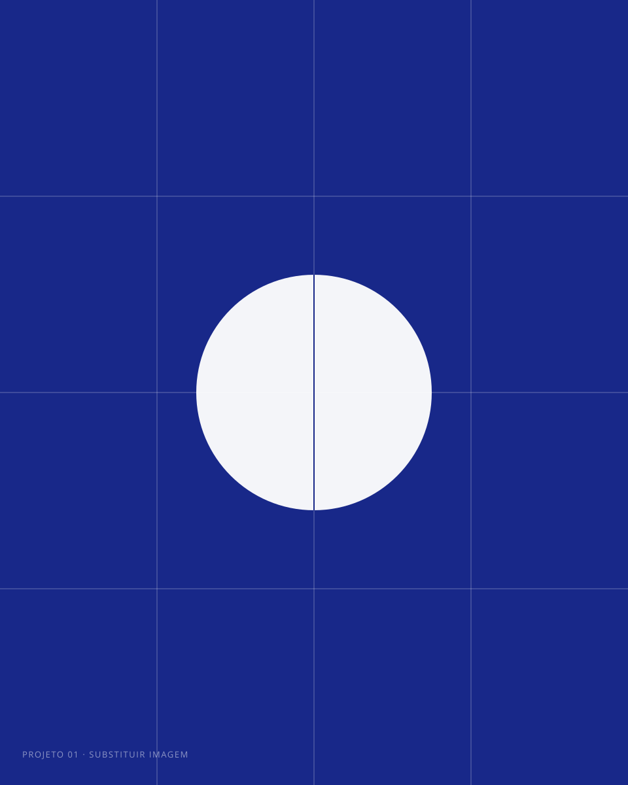

# Atalho Studio — site

Site estático (HTML, CSS e JavaScript puros). Não precisa de build, Node, banco
de dados nem plugin. Basta enviar os arquivos para a hospedagem.

---

## 1. Como publicar na Hostinger

1. Entre no **hPanel** → **Sites** → escolha o seu domínio → **Gerenciador de arquivos**.
2. Abra a pasta **`public_html`** e apague o que estiver lá (normalmente um
   `default.php` ou uma página de "em construção").
3. Selecione **todo o conteúdo desta pasta** — os arquivos `.html`, a pasta
   `assets`, o `.htaccess`, o `robots.txt` e o `sitemap.xml` — e compacte em um `.zip`.
4. No Gerenciador de arquivos, clique em **Upload** e envie o `.zip`.
5. Clique com o botão direito no arquivo enviado → **Extract / Extrair**.
6. Apague o `.zip` e pronto: o site já está no ar.

> **Importante:** o conteúdo tem que ficar solto dentro de `public_html`, e não
> dentro de uma subpasta. O arquivo `index.html` precisa estar em
> `public_html/index.html`.

Se preferir FTP, os dados de acesso ficam em **hPanel → Arquivos → Contas de FTP**.

Depois de publicar, ative o **SSL grátis** em *Segurança → SSL*. Com o certificado
ativo, abra o `.htaccess` e descomente as três linhas que forçam `https`.

---

## 2. O que tem em cada arquivo

```
index.html            página única (estúdio, serviços, cronograma, projetos, dúvidas, contato)
projeto-01.html       página do projeto 1 — Meridiano Capital
projeto-02.html       página do projeto 2 — Verda
projeto-03.html       página do projeto 3 — Norte Coletivo
.htaccess             configuração do servidor (cache, compressão, URLs limpas)
robots.txt            instruções para buscadores
sitemap.xml           mapa do site para o Google

assets/css/style.css  todo o visual do site
assets/css/fonts.css  declaração da Open Sans
assets/js/main.js     menu, acordeão, animações e formulário
assets/fonts/         Open Sans hospedada no próprio site
assets/video/sistema.mp4   vídeo da seção Sistema (H.264, 108 KB)
assets/video/sistema.webm  o mesmo vídeo em WebM, para quem suporta
assets/img/sistema-poster.jpg  quadro que aparece antes do play
assets/img/favicon.svg  ícone da aba do navegador
assets/img/logo*.svg    a marca que você enviou, guardada mas fora de uso
assets/img/*.svg        imagens dos projetos (espaços reservados)
```

---

## 3. O que trocar antes de publicar

Tudo abaixo é texto simples dentro dos arquivos `.html` — pode editar em
qualquer editor (VS Code, Bloco de Notas, ou o próprio editor da Hostinger).

**Dados de contato** — em `index.html`, procure por `contato@atalhostudio.com.br`:

- e-mail (aparece 2 vezes: na lista de contato e no atributo `data-to` do formulário);
- WhatsApp: troque `5511999999999` pelo seu número com DDI e DDD;
- Instagram: troque `atalho.studio`.

**Números do estúdio** — a seção "Estúdio" tem `40+` e `6–8`. Ajuste para a
sua realidade.

**A frase do hero** — o `<h1>` do `index.html`, com a linha de apoio logo
abaixo (`.hero__lead`) e os dois botões. As duas quebram sozinhas: o título em
até 15 caracteres por linha, a linha de apoio em até 34 (`max-width` em
`.hero h1` e `.hero__lead`).

**Domínio** — em `robots.txt` e `sitemap.xml`, troque
`https://www.atalhostudio.com.br` pelo seu endereço real.

---

## 4. Como trocar as imagens

As imagens que vieram no pacote são **espaços reservados** em SVG (formas
geométricas nas cores da marca). Você pode:

**Opção A — manter o nome do arquivo (mais simples).**
Salve a sua imagem com o mesmo nome do arquivo original, mas com a extensão
certa, e ajuste o `src` no HTML. Exemplo, em `index.html`:

```html
<!-- antes -->

<!-- depois -->

```

**Opção B — trocar direto pela pasta.**
Envie os arquivos novos para `assets/img/` e atualize os `src` correspondentes.

Proporções usadas no layout (para cortar as imagens sem deformar):

| Onde | Arquivo atual | Proporção | Tamanho sugerido |
|---|---|---|---|
| Cartão de projeto (home) | `project-01/02/03.svg` | 4:5 (vertical) | 960 × 1200 px |
| Capa da página de projeto | `cover-01/02/03.svg` | 16:9 | 1600 × 900 px |
| Galeria dupla | `gal-a` … `gal-d.svg` | 4:3 | 1200 × 900 px |
| Galeria larga | `cover-0X.svg` | 16:9 | 1600 × 900 px |

Salve as fotos em **JPG** (qualidade 80) ou **WebP** e mantenha cada arquivo
abaixo de 300 KB — o site fica rápido e o Google gosta.

### O logo

A marca no cabeçalho e no rodapé é **a palavra "atalho" escrita em Open Sans**,
como texto — não é imagem. Isso deixa tudo nítido em qualquer tela, sem
download nenhum, e a cor acompanha automaticamente o fundo (clara sobre o hero,
azul sobre fundo claro).

Para mudar tamanho ou peso, edite `assets/css/style.css`:

```css
.brand{
  font-size: 21px;          /* tamanho */
  font-weight: 600;         /* 300, 400, 600 ou 700 */
  letter-spacing: -.035em;  /* mais negativo = letras mais juntas */
}
```

O arquivo de marca que você enviou continua guardado em
`assets/img/logo.svg` e `assets/img/logo-branco.svg`. Se quiser voltar a usá-lo,
troque no HTML das 4 páginas o texto por uma imagem:

```html
<!-- de -->
<a class="brand" href="./">atalho</a>
<!-- para -->
<a class="brand" href="./" aria-label="Atalho Studio — início">
  
</a>
```

(No hero e no rodapé, use `logo-branco.svg`.)

O favicon é a letra "a" da Open Sans em branco sobre o quadrado azul, em
`assets/img/favicon.svg`.

### A fonte

O site inteiro usa **Open Sans**, hospedada no próprio servidor
(`assets/fonts/`) — nada é buscado no Google. É um único arquivo variável, com
os pesos de 300 a 700 e a acentuação do português inteira, em 88 KB.

## 5. Como funciona o formulário de contato

Por padrão, ao clicar em **Enviar mensagem** o site monta um e-mail já
preenchido e abre o programa de e-mail do visitante. Funciona em qualquer
hospedagem, sem configuração — mas depende de o visitante ter um app de e-mail
configurado.

Para receber as mensagens direto na sua caixa de entrada, escolha uma opção:

**Opção A — Formspree (grátis até 50 mensagens/mês, 2 minutos para configurar)**

1. Crie uma conta em `formspree.io` e um novo formulário. Você recebe uma URL
   parecida com `https://formspree.io/f/xxxxxxx`.
2. Em `index.html`, troque a linha de abertura do formulário por:

```html
<form class="form reveal" data-d="1" action="https://formspree.io/f/xxxxxxx" method="POST">
```

   (remova os atributos `id="form"`, `data-to` e `novalidate`).

3. Em `assets/js/main.js`, o bloco do formulário deixa de agir sozinho, porque
   ele só procura por um formulário com `id="form"`. Nada mais a fazer.

**Opção B — PHP da própria Hostinger**

A Hostinger executa PHP nos planos pagos. Crie um `enviar.php` na raiz com a
função `mail()` e aponte o `action` do formulário para ele. Se preferir esse
caminho, é só pedir que eu escrevo o arquivo.

---

## 6. O vídeo (seção Sistema)

A seção "Como um projeto anda" traz um filme de 20 segundos que explica o
sistema do estúdio em cinco atos: contato, conversa assíncrona, briefing,
cronograma e entregas.

O player não baixa nada até alguém clicar em "Assistir": antes disso existe só
a imagem de capa (19 KB). O vídeo vai em dois formatos e o navegador escolhe —
WebM para quem suporta, MP4 para todo o resto.

### Trocar pelo seu vídeo

1. Exporte em **MP4 (H.264)**, 1600 × 900 ou 1920 × 1080, e salve como
   `assets/video/sistema.mp4`, sobrescrevendo o atual.
2. Exporte um quadro de capa e salve como `assets/img/sistema-poster.jpg`.
3. Se não tiver a versão WebM, apague o atributo `data-src-webm` da linha do
   `<figure class="video">` no `index.html`.

Mantenha o MP4 abaixo de 10 MB. Se o seu filme for maior, use YouTube ou Vimeo.

### Usar YouTube ou Vimeo

O player só carrega o embed depois do clique, então a página continua leve:

```html
<!-- YouTube: o ID é o que vem depois de v= na URL -->
<figure class="video reveal" data-youtube="SEU_ID_AQUI">

<!-- Vimeo: o ID é o número no fim da URL -->
<figure class="video reveal" data-vimeo="123456789">
```

Nos dois casos, apague `data-src` e `data-src-webm`, e troque a imagem de capa
dentro do `<figure>`.

### Como o vídeo atual foi feito

Não é filmagem nem software de motion: é uma animação em SVG desenhada por
código, renderizada quadro a quadro e codificada em vídeo. O arquivo-fonte da
animação não vai junto do site — se você quiser mudar o filme, o caminho normal
é exportar um novo de onde preferir e sobrescrever os arquivos acima.

O texto do botão ("Assistir · 20s") está no próprio `<button>`, e a linha
abaixo do vídeo está no bloco `<div class="video-meta">`. É texto comum.

## 7. Como adicionar um quarto projeto

1. Duplique `projeto-03.html` e renomeie para `projeto-04.html`.
2. Edite o conteúdo: título, textos, números e imagens.
3. Em `index.html`, dentro de `<div class="projects">`, duplique um bloco
   `<a class="project">…</a>` e aponte para `projeto-04.html`.
4. Acrescente o link no rodapé das quatro páginas e no `sitemap.xml`.

O layout dos projetos usa grade automática: com 4 cartões ele quebra em duas
linhas sozinho, sem precisar mexer no CSS.

---

## 8. Onde mexer no visual

Tudo o que define a aparência está no topo de `assets/css/style.css`, no bloco
`:root`. Trocar uma variável ali muda o site inteiro:

```css
--brand:  #182889;  /* azul de destaque */
--ink:    #0d0e13;  /* preto dos blocos escuros */
--paper:  #f4f4f0;  /* off-white de fundo */
--shell:  1240px;   /* largura máxima do conteúdo */
```

### A barra de navegação

A barra é um elemento separado do hero: fica no fluxo da página, acima dele, na
mesma cor das dobras claras (`--paper`), com um filete embaixo para se ler como
elemento próprio mesmo quando o fundo abaixo tem a mesma cor. Ao rolar ela gruda
no topo, encolhe um pouco e ganha uma sombra rasa.

Os links são escuros, sem esmaecer, e o retorno ao passar o mouse é um
sublinhado. O botão "Iniciar projeto" fica azul dentro da barra, para ter
contraste. O menu mobile usa a mesma superfície.

Para mudar a cor da barra, edite `.header` em `assets/css/style.css`:

```css
.header{ background:var(--paper); color:var(--ink); }
```

### O hero

Painel escuro dividido em dois: texto à esquerda, um campo de pixels à direita.
Não é imagem nem vídeo — é desenhado em `<canvas>` a cada quadro, na seção 7 do
`assets/js/main.js`.

O desenho é chapado de propósito: **uma grade fixa de células quadradas, todas
do mesmo tamanho e da mesma cor**, sem perspectiva e sem sombra. Quem cria o
tom é o dithering.

Três formas se sucedem em ciclo:

| | forma | o que é |
|---|---|---|
| 1 | estrela | a marca: superelipse de quatro pontas, girando |
| 2 | setas | duas setas grossas para a direita, com uma luz que as atravessa |
| 3 | redemoinho | braços em espiral saindo do centro |

#### Como funciona

Cada forma é um **campo**: uma função que recebe um ponto da tela e o tempo, e
devolve um valor de 0 a 1.

```js
var estrela = function (x, y, t) {
  var a = t * 0.17, c = Math.cos(a), s = Math.sin(a), R = 1.15;
  var u = (x * c + y * s) / R, w = (-x * s + y * c) / R;
  var d = Math.pow(Math.abs(u), 0.6) + Math.pow(Math.abs(w), 0.6);
  return (1 - d) / 0.20;
};
```

Quem transforma esse valor em preto e branco é o **dithering**, com a matriz
Bayer 8×8 — a mesma das versões anteriores do hero. Quanto maior o valor, mais
chance a célula tem de acender:

```js
if (v > 0.30 + (BAYER[j & 7][i & 7] / 64) * 0.58) {
  ctx.fillRect(px, py, LADO, LADO);
}
```

Sem dithering, um degradê viraria uma borda dura; com ele, vira uma
transição esfarelada em pixels.

A troca entre duas formas é a interpolação entre os dois campos, com um atraso
diferente por célula. Por isso uma forma se desmancha em pixels enquanto a
outra se escreve por cima, em vez de haver um corte.

#### O que dá para ajustar

```js
var PARADO = 3.4, TRANS = 1.9;   // segundos parado em cada forma / de transição
var COR = '#d9e0fa';             // cor dos pixels
```

Com três formas, o ciclo inteiro dá 16 segundos.

A cor dos pixels é clara de propósito: o fundo do hero é o azul da marca
(`--brand`, o mesmo do botão da barra de navegação), e sobre ele um tom médio
perde contraste e o desenho some.

Trocar uma forma é trocar uma função e o nome dela na lista:

```js
var CAMPOS = [estrela, setas, redemoinho];
```

Nas setas, três números mandam:

```js
var ALTURA = 0.62, GROSSURA = 0.30, PASSO_SETA = 0.68;
```

A folga entre as duas é `PASSO_SETA - 2 × GROSSURA`. Engrossar sem afastar
funde as duas numa mancha só. E a luz que varre as setas não pode descer
demais, ou apaga metade delas abaixo do piso do dither.

O tamanho do pixel vem do tamanho do painel, em `medir()`:

```js
PASSO = Math.max(9, Math.min(15, Math.round(Math.min(larg, alt) / 40)));
LADO  = Math.max(3, Math.round(PASSO * 0.62));
```

`PASSO` é a distância de um pixel ao outro e `LADO` é o quadrado desenhado — a
diferença entre os dois é o preto que sobra entre eles.

Na superelipse da estrela, o expoente `0.6` é o que faz as pontas: acima de 1 a
forma é um retângulo arredondado, em 1 é um losango, e **abaixo de 1 os lados
ficam côncavos**. O `0.20` é a espessura da borda esfarelada: mais que isso e a
estrela encolhe, porque o dither come as pontas.

#### O sangramento

O campo (`.painel__arte`) cobre o hero inteiro, por baixo do texto, e as formas
são grandes de propósito: elas passam das bordas e são cortadas por elas. É o
corte que dá o efeito.

Três números governam isso, na função `medir()`:

```js
meia   = Math.min(larg, alt) * 0.66;    // tamanho das formas
cxArte = deitado ? larg * 0.64 : larg * 0.5;    // centro do desenho
cyArte = deitado ? alt  * 0.5  : alt  * 0.70;
```

`meia` é o tamanho: subir faz a forma crescer e sangrar mais. `cxArte` e
`cyArte` dizem onde ela fica — no formato deitado o texto ocupa a esquerda,
então o desenho é jogado para a direita; no formato em pé ele desce para
baixo do texto.

Para o texto não brigar com os pixels, o desenho **se dissolve** ao chegar
perto dele. Não é uma máscara por cima: é o próprio valor do campo que cai, e
o dithering rareia os pixels sozinho — por isso a passagem não tem borda.

```js
var a2 = (px / larg - 0.24) / 0.22;   // deitado: some da esquerda para a direita
var atenY = (py / alt - 0.40) / 0.22; // em pé: some de cima para baixo
```

O desenho roda a 20 quadros por segundo e para sozinho quando o hero sai da
tela. Com `prefers-reduced-motion` ligado, desenha só a estrela, parada.

### O espaçamento entre as dobras

Um único token controla o respiro de todas as seções:

```css
--section: clamp(56px, 6.2vw, 96px);
```

### O cronograma

O diagrama da seção "Processo" é montado com duas variáveis por barra, dentro
do `index.html`:

```html
<span class="gantt__bar" style="--s:1; --n:2">Semanas 1–2</span>
```

`--s` é a semana em que a fase começa (1 a 8) e `--n` é quantas semanas ela dura.
Para trabalhar com mais semanas, mude o `repeat(8, 1fr)` das regras
`.gantt__scale`, `.gantt__track` e `.gantt__miles` no CSS.
